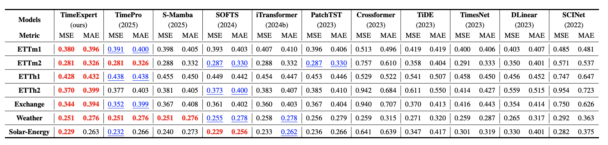
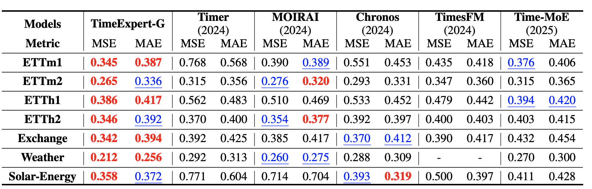

<div align="center">
<h1>TimeExpert </h1>
<h3>TimeExpert: Boosting Long Time Series Forecasting with Temporal Mix of Experts</h3>
 [[Paper Link]()]

</div>

## 🔥 News
- **`2025/09/30`**: **Code for TimeExpert is available.**


## 📷 Introduction

### 1️⃣ Preliminaries
“one-size-fits-all” standard formulation of vanilla Transformer suffers from two critical flaws for real-world time series:
- inherent lag effects, where the relevance of historical timestamps to a query varies dynamically; 
- anomalous segments, which introduce noisy signals that degrade forecasting accuracy


### 2️⃣ Architecture


### 3️⃣ Performance





## 📚 Use example

- Environment

  ```shell
  conda create --name timeexpert python=3.8 -y
  conda activate timeexpert
  pip install -r requirements.txt
  ```

- Dataset

  The dataset can be download at this [link](https://github.com/xwmaxwma/TimeExpert/releases/download/dataset/TimeExpert_dataset.zip)

- Train

  ```shell
  bash scripts/TimeExpert_Exchange.sh
  bash scripts/TimeExpert_SolarEnergy.sh
  bash scripts/TimeExpert_Weather.sh
  bash scripts/TimeExpert_ETTh1.sh
  bash scripts/TimeExpert_ETTh2.sh
  bash scripts/TimeExpert_ETTm1.sh
  bash scripts/TimeExpert_ETTm2.sh
  ```


## 🌟 Citation

If you are interested in our work, please consider giving a 🌟 and citing our work below.

```

```


## 💡Acknowledgment

Thanks to the main contributor **Shuning Ge**.
